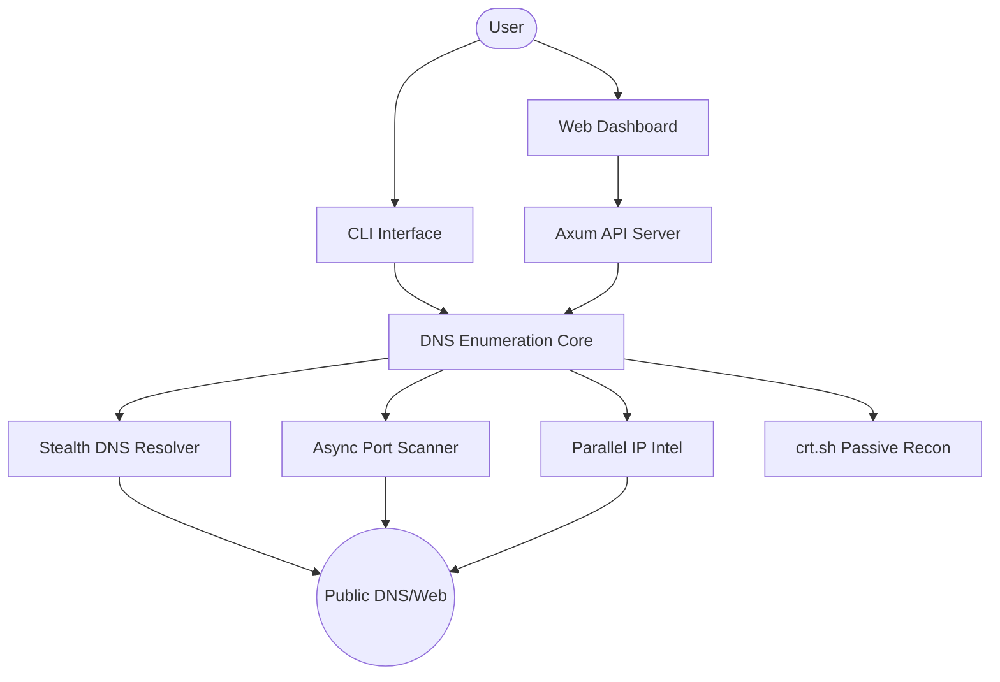

# 🛰️ DNS Enumeration v0.6.0
### *Optimized DNS Scoping & Infrastructure Reconnaissance Platform*

```text
  ____                ___                    _____             _             
 / ___|  ___  ___ ___| _ \ _ __  ___       | ____|_ __   __ _(_)_ __   ___ 
 \___ \ / _ \/ __/ _ \ |_) | '_ \/ __|_____|  _| | '_ \ / _` | | '_ \ / _ \
  ___) |  __/ (_| (_) |  __/| | | \__ \_____| |___| | | | (_| | | | | |  __/
 |____/ \___|\___\___/|_|   |_| |_|___/     |_____|_| |_|\__, |_|_| |_|\___|
                                                         |___/              
```

[](https://www.rust-lang.org/)
[](LICENSE)
[]()
[]()

[Features](#-key-features) • [Installation](#-installation) • [Architecture](#-architecture) • [Usage](#-usage) • [Legal](#-disclaimer)

---

## 🛡️ Introduction

**DNS Enumeration**, siber güvenlik araştırmacıları ve pentest uzmanları için geliştirilmiş; yüksek performanslı, asenkron ve altyapı odaklı bir keşif aracıdır. Gereksiz web tarama yüklerinden arındırılarak sadece çekirdek DNS kayıtlarına, pasif OSINT verilerine ve hızlı port taramasına odaklanacak şekilde optimize edilmiştir.

## ✨ Key Features

- 🕵️ **Advanced OSINT:** `crt.sh` entegrasyonu ile pasif subdomain keşfi.
- ⚡ **Turbo Core:** 
  - **Parallel IP Intel:** Birden fazla IP için RDAP sorgularını eşzamanlı gerçekleştirme.
  - **Jitter-Free Brute Force:** Subdomain keşfini yavaşlatan suni gecikmeler kaldırıldı.
- 🚀 **Async Port Scanner:** En kritik TCP portlarını milisaniyeler içinde tarayan `tokio` destekli motor.
- 🧪 **Security Auditing:** SPF, DMARC ve DKIM kayıtlarını otomatik analiz eder.
- 🔬 **Zone Transfer (AXFR):** Tüm Name Server'lar üzerinde bölge transferi denemeleri.
- 📊 **Interactive Dashboard:** `vis-network.js` tabanlı topoloji haritası ve modern "Glassmorphism" UI.

## 🏗️ Architecture



## 🛠️ Installation

### Prerequisites
- [Rust](https://www.rust-lang.org/tools/install) (latest stable)

### Build from source
```bash
git clone https://github.com/mahmutcirka/DNS-Enumeration.git
cd DNS-Enumeration
cargo build --release
```

## 🚀 Usage

### 💻 Command Line Interface
```bash
# DNS ve Güvenlik taraması yap
cargo run --release -- pentest dns example.com

# Özel bir wordlist ile brute-force yap
cargo run --release -- pentest dns example.com --wordlist subdomains.txt
```

### 🌐 Web Dashboard (Modern UI)
```bash
# Sunucuyu başlat (Varsayılan Port: 3000)
cargo run --release -- server --port 3000
```
Tarayıcıda `http://localhost:3000` adresine giderek etkileşimli analiz ekranına ulaşabilirsiniz.

---

## ⚖️ Disclaimer

> [!CAUTION]
> Bu araç sadece **eğitim ve yasal penetrasyon testleri** amaçlıdır. İzin alınmayan sistemler üzerinde tarama yapmak yasal sonuçlar doğurabilir. Kullanıcı, yaptığı eylemlerden tamamen kendisi sorumludur.

---
<div align="center">
Built with 🦀 by **Mahmut Cırka**
</div>