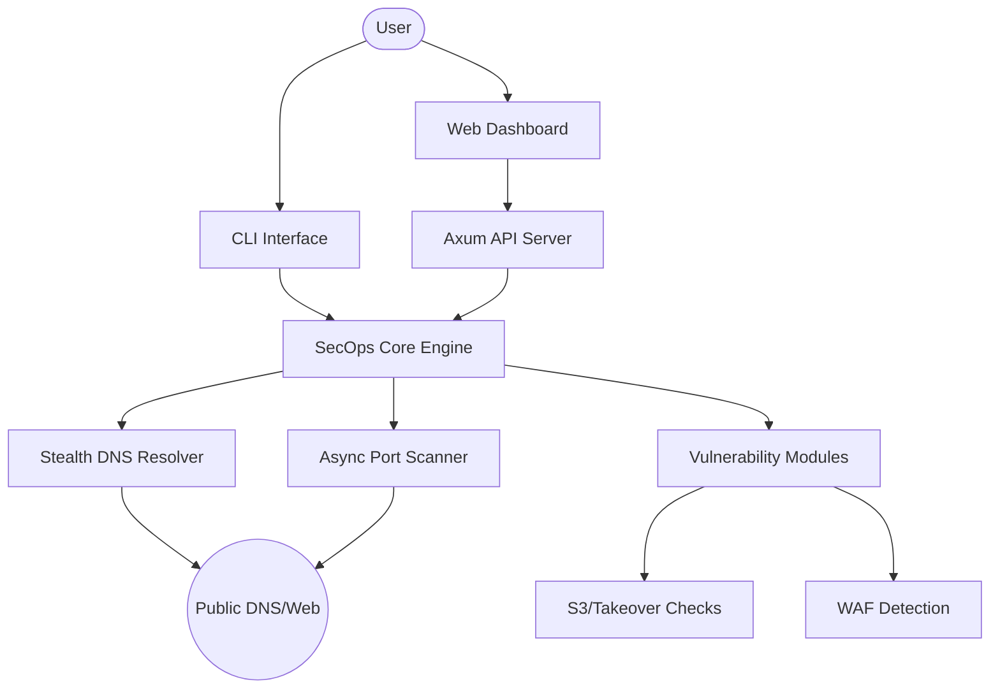

<div align="center">


# 🛰️ SecOps Engine v0.4.0
### *Advanced DNS Enumeration & Security Auditing Platform*

[](https://www.rust-lang.org/)
[](LICENSE)
[]()
[]()

[Features](#-key-features) • [Installation](#-installation) • [Architecture](#-architecture) • [Dashboard](#-web-dashboard) • [Legal](#-disclaimer)

</div>

---

## 🛡️ Introduction

**SecOps Engine**, siber güvenlik araştırmacıları ve pentest uzmanları için geliştirilmiş; yüksek performanslı, asenkron ve çok katmanlı bir istihbarat toplama aracıdır. Alan adlarını sadece listelemekle kalmaz, aynı zamanda WAF tespiti, S3 sızıntıları, DNS takibi ve port taraması yaparak kapsamlı bir risk haritası oluşturur.

## ✨ Key Features

- 🕵️ **Advanced OSINT:** `crt.sh` entegrasyonu ile pasif subdomain keşfi.
- ⚡ **Asenkron Port Scanner:** En kritik TCP portlarını milisaniyeler içinde tarayan `tokio` destekli motor.
- 🎭 **Stealth & Evasion:**
  - **User-Agent Rotation:** Her istekte değişen tarayıcı kimlikleri.
  - **DNS Resolver Rotation:** Google, Cloudflare, Quad9 ve OpenDNS arasında otomatik rotasyon.
  - **Request Jitter:** Bloklanmayı önlemek için ayarlanabilir rastgele gecikmeler.
- 🪣 **Cloud Leak Detection:** Amazon S3 kova (bucket) sızıntısı ve subdomain takeover (devralma) kontrolleri.
- 🧱 **Firewall Awareness:** Web Uygulama Güvenlik Duvarı (WAF) tespiti ve güvenlik başlıkları analizi.
- 📊 **Interactive Dashboard:** `vis-network.js` tabanlı topoloji haritası ve modern "Glassmorphism" UI.

## 🏗️ Architecture



## 🛠️ Installation

### Prerequisites
- [Rust](https://www.rust-lang.org/tools/install) (latest stable)
- [Just](https://github.com/casey/just) (optional, for automation tasks)

### Build from source
```bash
git clone https://github.com/youruser/ISU-SecOps-Engine.git
cd ISU-SecOps-Engine
cargo build --release
```

## 🚀 Usage

### 💻 Command Line Interface
```bash
# DNS ve Güvenlik taraması yap
cargo run -- pentest dns example.com

# Özel bir wordlist ile brute-force yap
cargo run -- pentest dns example.com --wordlist subdomains.txt
```

### 🌐 Web Dashboard (Modern UI)
```bash
# Sunucuyu başlat (Varsayılan Port: 3000)
cargo run -- server --port 3000
```
Tarayıcıda `http://localhost:3000` adresine giderek etkileşimli analiz ekranına ulaşabilirsiniz.

---

## 📸 Web Dashboard Preview

````carousel

<!-- slide -->

<!-- slide -->

````

---

## ⚖️ Disclaimer

> [!CAUTION]
> Bu araç sadece **eğitim ve yasal penetrasyon testleri** amaçlıdır. İzin alınmayan sistemler üzerinde tarama yapmak yasal sonuçlar doğurabilir. Kullanıcı, yaptığı eylemlerden tamamen kendisi sorumludur.

---
<div align="center">
Built with 🦀 by ISU Security Team
</div>