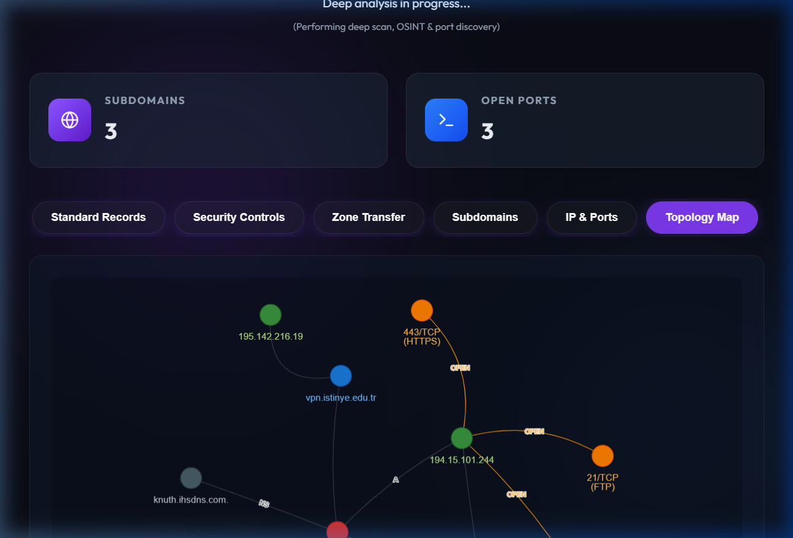
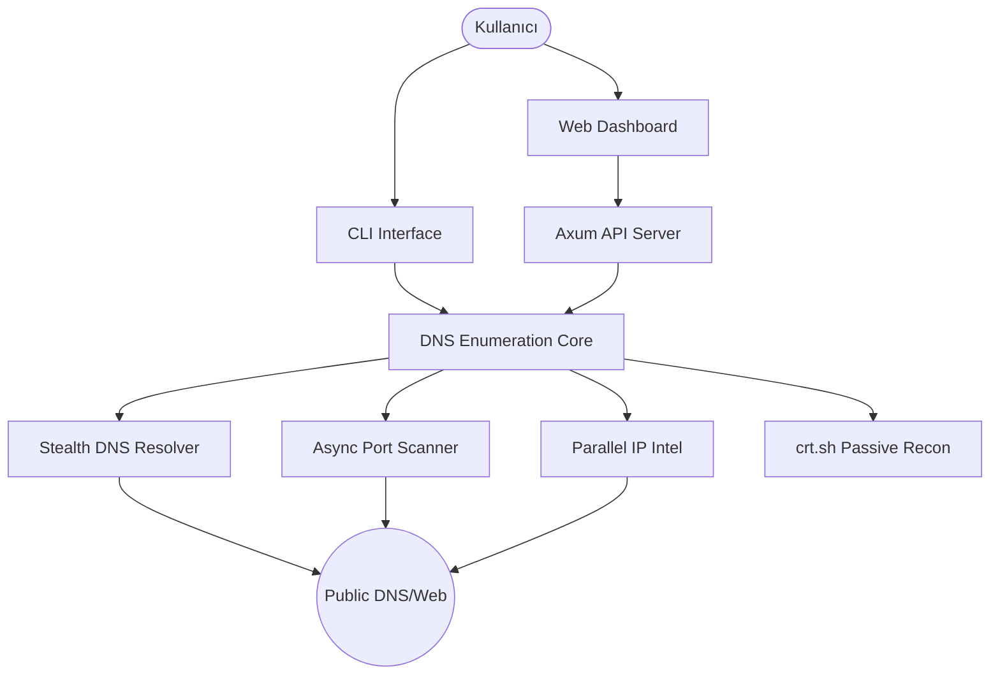

<div align="center">
  

  # 🛰️ DNS Enumeration & SecOps Engine v0.6.0
  ### *Advanced DNS Scoping & Infrastructure Reconnaissance*
  
  **🎓 Akademik Bilgiler**
  
  | **Ders** | **Öğretim Görevlisi** | **Bölüm** | **Öğrenci No** |
  | :--- | :--- | :--- | :--- |
  | Sızma Testi | Keyvan Arasteh Abbasabad | Bilişim Güvenliği Teknolojisi | 2520191026 |

  ---

  [](https://www.rust-lang.org/)
  [](LICENSE)
  [](https://github.com/mahmutcirka/ISU-SecOps-Engine)
  [](https://github.com/mahmutcirka/ISU-SecOps-Engine/actions)

</div>

---

## 📑 İçindekiler

1. [🛡️ Giriş](#️-giriş)
2. [🎬 Demo](#-demo)
3. [✨ Temel Özellikler](#-temel-özellikler)
4. [🏗️ Mimari Yapı](#️-mimari-yapı)
5. [🛠️ Kurulum](#️-kurulum)
6. [🚀 Kullanım](#-kullanım)
    - [💻 CLI Interface](#-command-line-interface)
    - [🌐 Web Dashboard](#-web-dashboard-modern-ui)
7. [🔬 Teknik Derinlik & SecOps](#-teknik-derinlik--secops)
8. [⚖️ Sorumluluk Reddi](#️-disclaimer)

---

## 🛡️ Giriş

**DNS Enumeration**, siber güvenlik araştırmacıları ve sızma testi (pentest) uzmanları için geliştirilmiş; yüksek performanslı, asenkron ve altyapı odaklı bir keşif aracıdır. Gereksiz web tarama yüklerinden arındırılarak sadece çekirdek DNS kayıtlarına, pasif OSINT verilerine ve hızlı port taramasına odaklanacak şekilde optimize edilmiştir.

---

## 🎬 Demo

Projenin tüm özelliklerini (CLI ve Web Dashboard) içeren kapsamlı demonstrasyon aşağıda sunulmuştur.

### 🌐 Web Dashboard & Topoloji Haritası
Modern ve interaktif arayüz üzerinden gerçekleştirilen analiz sürecini izleyebilirsiniz:

<p align="center">
  
</p>

*Görsel: Analiz sonucu oluşan dinamik ağ topolojisi.*
<p align="center">
  
</p>

### 🖥️ Komut Satırı (CLI) Kullanımı
Aracı terminal üzerinden `release` modunda çalıştırma örneği:

```bash
# Projeyi derleme
cargo build --release

# Örnek tarama yürütme
./target/release/dns-enumeration pentest dns istinye.edu.tr
```

#### Örnek Çıktı:
```text
🔍 Starting discovery phase for: istinye.edu.tr
✅ Discovery phase completed.

--- [ STANDARD RECORDS ] ---
A:      194.15.101.244
MX:     10 mail.istinye.edu.tr.
NS:     knuth.ihsdns.com.
NS:     dijkstra.ihsdns.com.

--- [ SECURITY CONTROLS ] ---
SPF:    v=spf1 include:_spf.google.com include:spf.protection.outlook.com ~all
DMARC:  v=DMARC1; p=none; sp=none; rua=mailto:dmarc@istinye.edu.tr

--- [ SUBDOMAIN DISCOVERY ] ---
www.istinye.edu.tr             194.15.101.244
mail.istinye.edu.tr            194.15.101.231
vpn.istinye.edu.tr             195.142.216.19

--- [ IP INTELLIGENCE & PORTS ] ---
IP: 194.15.101.244, ASN/Org: TR-TEAMBILGI, Country: TR
  [+] Port 21/TCP (FTP) is OPEN
  [+] Port 80/TCP (HTTP) is OPEN
  [+] Port 443/TCP (HTTPS) is OPEN
```

---

## ✨ Temel Özellikler

- 🕵️ **Advanced OSINT:** `crt.sh` entegrasyonu ile pasif subdomain keşfi.
- ⚡ **Turbo Core:** 
  - **Parallel IP Intel:** Birden fazla IP için RDAP sorgularını eşzamanlı gerçekleştirme.
  - **Async Port Scanner:** En kritik TCP portlarını milisaniyeler içinde tarayan `tokio` destekli motor.
- 🧪 **Security Auditing:** SPF, DMARC ve DKIM kayıtlarını otomatik analiz ederek e-posta güvenliği zafiyetlerini raporlar.
- 🔬 **Zone Transfer (AXFR):** Tespit edilen tüm Name Server'lar üzerinde bölge transferi denemeleri.
- 📊 **Interactive Dashboard:** `vis-network.js` tabanlı topoloji haritası ve modern "Glassmorphism" UI.

## 🏗️ Mimari Yapı



🔍 *Daha detaylı teknik analiz için [docs/ARCHITECTURE.md](docs/ARCHITECTURE.md) dosyasını inceleyebilirsiniz.*

## 🛠️ Kurulum

### Prerequisites
- [Rust](https://www.rust-lang.org/tools/install) (latest stable)

### Build from source
```bash
git clone https://github.com/mahmutcirka/ISU-SecOps-Engine.git
cd ISU-SecOps-Engine
cargo build --release
```

## 🚀 Kullanım

### 💻 Command Line Interface
```bash
# DNS ve Güvenlik taraması yap
cargo run --release -- pentest dns example.com

# Özel bir wordlist ile brute-force yap
cargo run --release -- pentest dns example.com --wordlist subdomains.txt
```

### 🌐 Web Dashboard (Modern UI)
```bash
# Sunucuyu başlat (Varsayılan Port: 3000)
cargo run --release -- server --port 3000
```
Tarayıcıda `http://localhost:3000` adresine giderek etkileşimli analiz ekranına ulaşabilirsiniz.

---

## 🔬 Teknik Derinlik & SecOps

Bu araç, bir sızma testinin "Reconnaissance" (Keşif) aşamasını otomatize etmek için tasarlanmıştır. `tokio-rs` asenkron çalışma zamanı sayesinde yüzlerce DNS sorgusunu ve port taramasını saniyeler içinde tamamlayabilir. Altyapı güvenliği açışından özellikle **SPF/DMARC** gibi e-posta güvenlik kayıtlarını analiz ederek, saldırganların hedef adına sahte e-posta gönderme (spoofing) riskini ölçer.

---

## ⚖️ Sorumluluk Reddi

> [!CAUTION]
> Bu araç sadece **eğitim ve yasal penetrasyon testleri** amaçlıdır. İzin alınmayan sistemler üzerinde tarama yapmak yasal sonuçlar doğurabilir. Kullanıcı, yaptığı eylemlerden tamamen kendisi sorumludur.

---
<div align="center">
Built with 🦀 for **İstinye University** SecOps Lab
</div>
