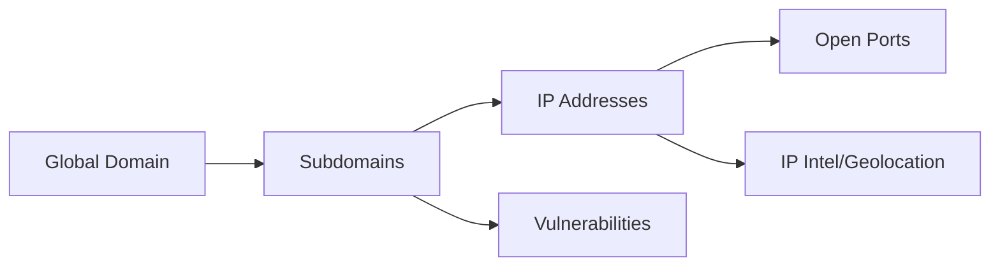

# 🏛️ DNS Enumeration: Architecture & Design

DNS Enumeration, asenkron yapısı ve modüler tasarımı ile yüksek hızda güvenlik taraması yapmak üzere kurgulanmıştır.

## ⚙️ Core Components

### 🕵️ OSINT & Discovery Layer
- **crt.sh Entegrasyonu:** Public sertifika şeffaflık loglarını kullanarak pasif subdomain keşfi yapar.
- **Enumeration Engine:** Dahili wordlist veya kullanıcıdan gelen wordlist ile senkronize brute-force yapar.

### 🛡️ Stealth Resolver (DNS Rotation)
Geleneksel tarayıcıların aksine, SecOps Engine her isteği farklı bir nameserver üzerinden geçirir:
- **Nameservers:** Google (8.8.8.8), Cloudflare (1.1.1.1), Quad9 (9.9.9.9), OpenDNS (208.67.222.222).
- **Fallback:** Firewall engellerini aşmak için sistemin kendi varsayılan DNS yapılandırması (OS-native) önceliklidir.
- **Rotate & Jitter:** `hickory-resolver` üzerinden her sorgu rotasyona tabi tutulur ve aralara 10-50ms arası rastgele gecikmeler (jitter) eklenir.

### ⚡ Port Scanning Engine
- **Asenkron TCP Scanner:** `tokio` kanalları ve `buffer_unordered` kullanarak aynı anda 20 portu paralel tarar.
- **Optimized Timeouts:** 2.5 saniyelik dinamik timeout süresi ile bağlantı kararlılığı sağlanır.

### 🧱 Vulnerability Analysis Layer
- **S3 Bucket Checker:** Varyasyonel `reqwest` istekleri ile "Access Denied" veya "Open" durumlarını raporlar.
- **CNAME Takeover Engine:** Subdomain devralma zafiyetlerini (gh-pages, s3 vb.) tespit eder.
- **WAF Detection:** Zararsız fakat yaygın SQLi payloadları ile firewall yanıt paternlerini analiz eder.

## 🌐 Web Architecture (Dashboard)

- **Backend:** Axum (Rust) tabanlı yüksek performanslı HTTP API.
- **Frontend:** Vanilla JS & CSS (Glassmorphism design).
- **Visuals:** `vis-network.js` kullanılarak domain hiyerarşisi (A, AAAA, CNAME, Open Ports) bir topoloji haritasına dönüştürülür.

## 🔐 Security Standards
- **Zero-Warning Policy:** Kod bazında `clippy` ve `fmt` uyarıları barındırılmaz.
- **Robustness:** Tüm `async` fonksiyonlar `Send` trait uyumluluğuna sahip olup, timeout ve panic korumalıdır.
